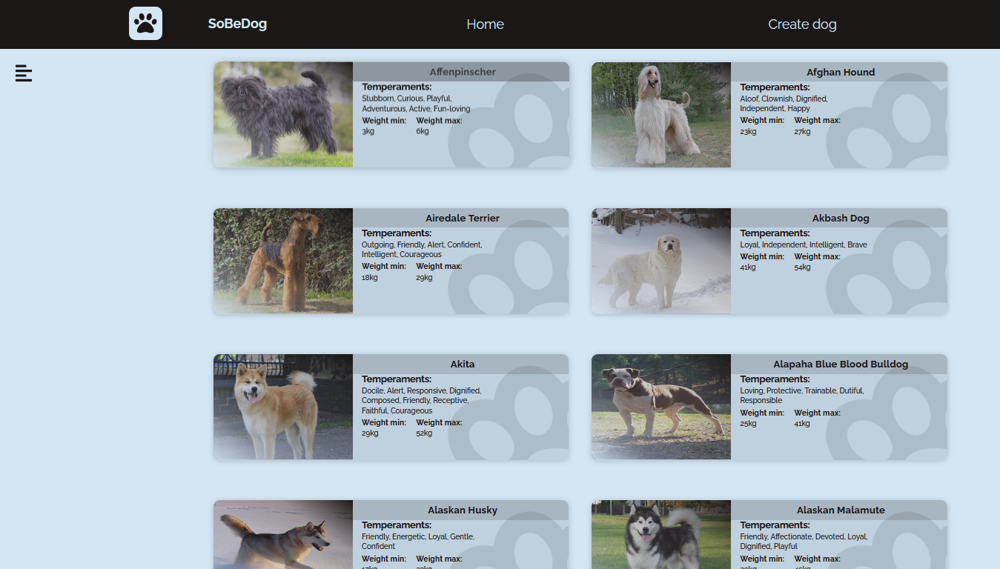
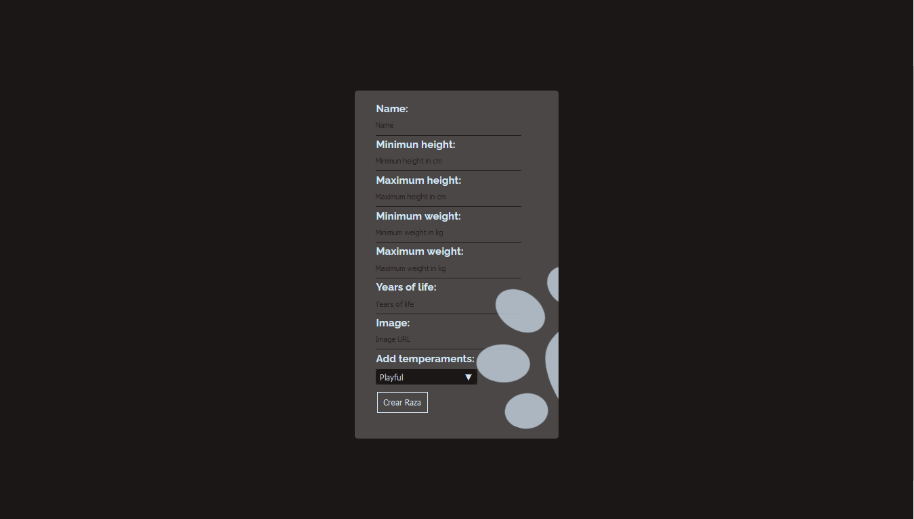
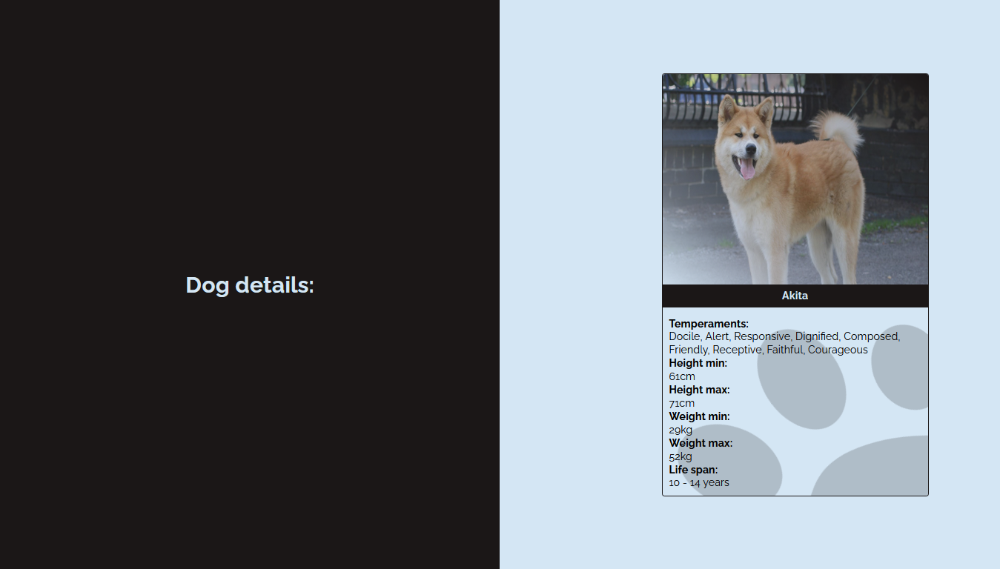
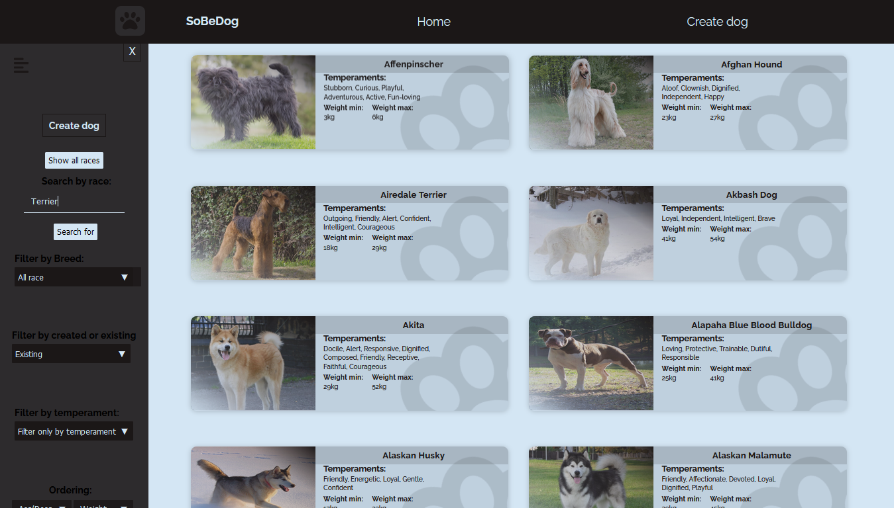
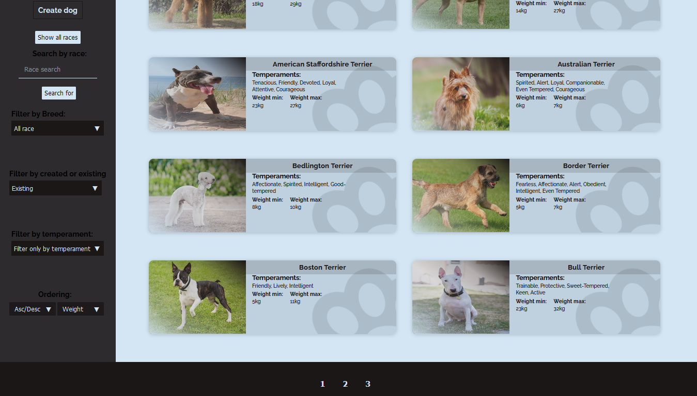
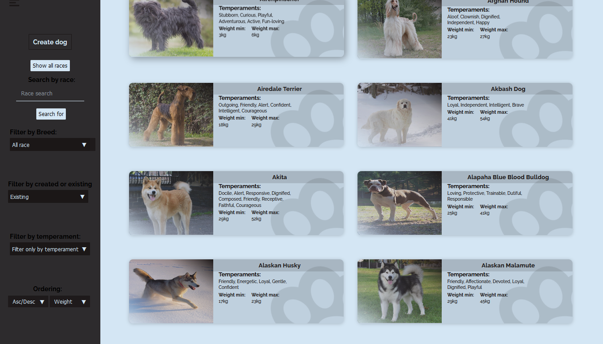

# SoBeDog

SoBeDog, a one page application that consists of displaying all kinds of breeds and much more ...

## Landing Page.

## Sample of all types of race.

<h3>In this section the upper part has access to the Landing Page, the home page that is the current one and for the creation of a race</h3>
<h3>Through the backend API you can show the races of an external API and the race created by the users that are stored in a database.</h3>

## The following form allows the creation of a breed in preference, each input has a careful validation: 

## This section provides more detailed information about each race, just when you press the button of the name of the race in the home section:

## Search for the breed you like and filter according to the breed you want:

## Finally, you can see what makes it easy to do this sidebar: Search by race, filter by race, temperaments or by external API or those created by the user, Sort by alphabetic order or weight in ascending or descending order:

